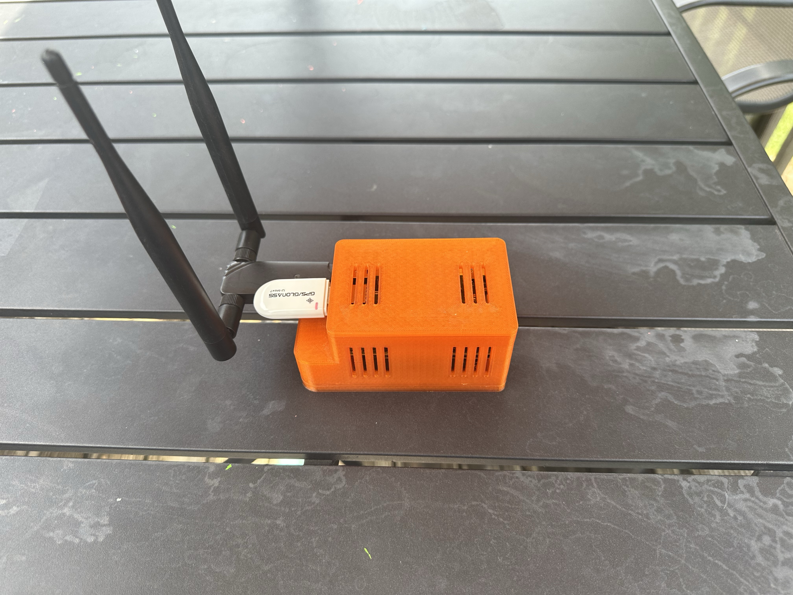
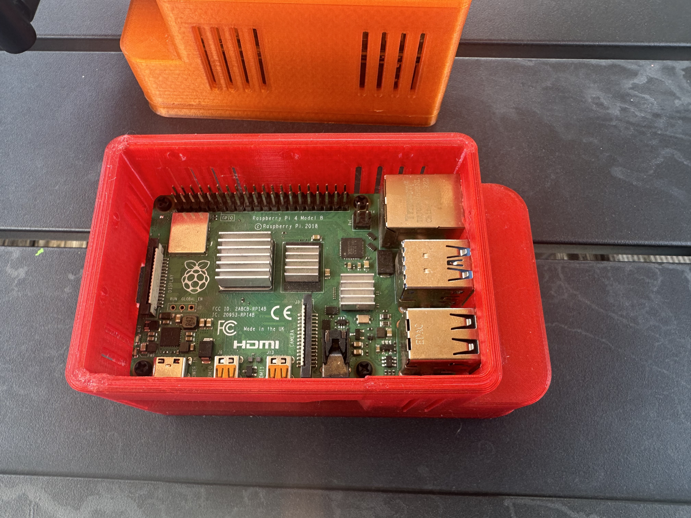
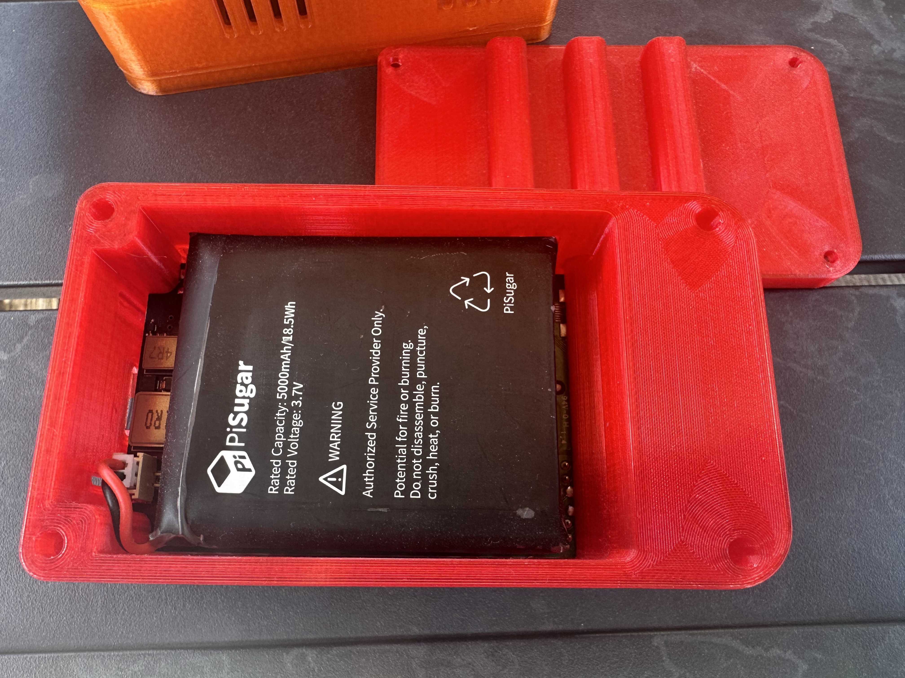
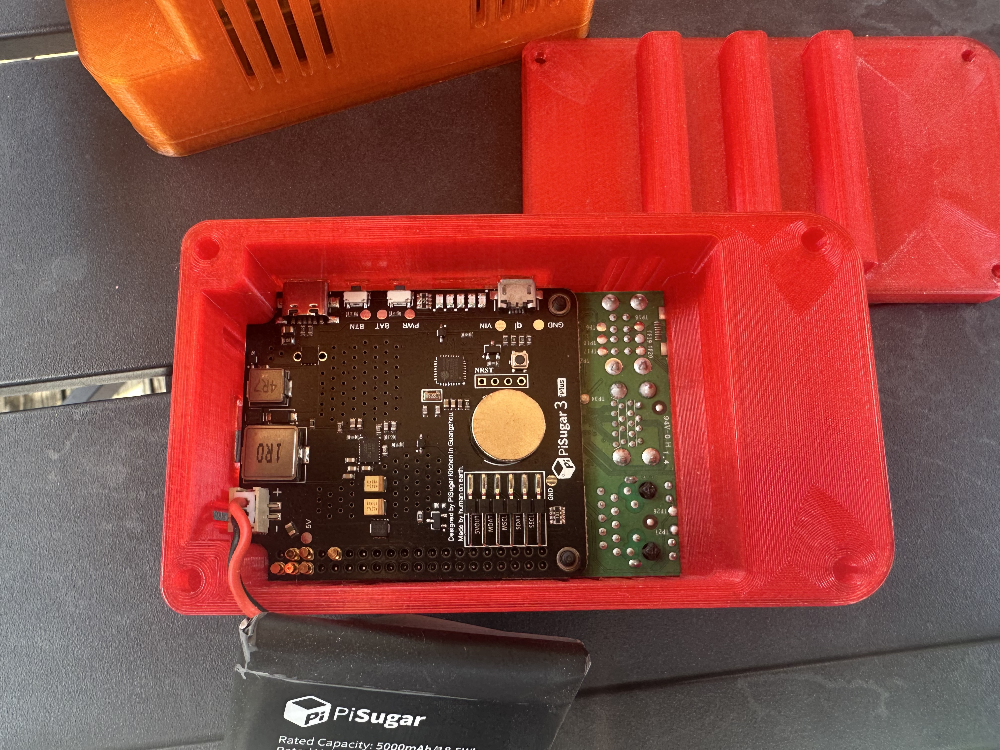

# **wifi-pi**

```
<p align="center">
  
  <br><em>Assembled wifi-pi with 3D-printed case</em>
</p>
```

**wifi-pi** is a portable Raspberry Pi 4-based wireless testing platform. It supports rogue AP attacks, DNS interception, packet collection, and red team field ops. This repo includes all STL files to 3D print your own enclosure, configuration files, and setup guidance.

---

## **✅ System Setup**

```
<p align="center">
  
  
  
  <br><em>Exploded view of the wifi-pi case components</em>
</p>
```

- **Device**: Raspberry Pi 4
    
- **Battery**: PiSugar 3
    
- **OS**: Kali Linux 2025.1a Minimal ARMHF custom image
    
- **Boot Config**: /boot/firmware/cmdline.txt
    
- **IPv6**: Fully disabled via kernel flag: ipv6.disable=1
    

  

Use [Etcher](https://etcher.io) to flash the OS to SD card. Default credentials: kali/kali.

  

Connect via PiKVM for initial setup. **Unplug the Pi from the network** during configuration.

  

### **Make it Headless**

```
sudo apt purge -y kali-desktop-xfce xfce4* lightdm*
sudo apt autoremove -y
sudo reboot
```

---

## **📡 Networking Design**

|**Interface**|**Purpose**|**IP**|**Subnet**|**Notes**|
|---|---|---|---|---|
|wlan0|Admin network|10.10.10.10|10.10.10.0/24|Control, SSH, updates|
|wlan1|Victim network|10.100.10.1|10.100.10.0/24|DHCP, NAT, rogue services|

### **Disabled Services**

- systemd-networkd
    
- dhcpcd, dhclient
    
- NetworkManager
    
- /etc/resolv.conf replaced with static file (locked with chattr +i)
    

  

### **/etc/network/interfaces**

```
auto lo
iface lo inet loopback

auto eth0
iface eth0 dhcp

auto wlan0
iface wlan0 inet static
  wpa-ssid "Control"
  wpa-psk "<wifi password>"
  address 10.10.10.10
  netmask 255.255.255.0
  gateway 10.10.10.1
  dns-nameservers 8.8.8.8 8.8.4.4

auto wlan1
iface wlan1 inet static
  address 10.100.10.1
  netmask 255.255.0.0
  network 10.10.0.0
```

---

## **🔧 DHCP Setup**

- **Package**: isc-dhcp-server
    

  

/etc/dhcp/dhcpd.conf

```
authoritative;
default-lease-time 600;
max-lease-time 7200;
log-facility local7;

subnet 10.100.10.0 netmask 255.255.255.0 {
  range 10.100.10.100 10.100.10.150;
  option routers 10.100.10.1;
  option domain-name-servers 8.8.8.8, 8.8.4.4;
}
```

/etc/default/isc-dhcp-server

```
INTERFACESv4="wlan1"
```

---

## **🔄 IP Forwarding & NAT**

  

Enable forwarding in /etc/sysctl.conf:

```
net.ipv4.ip_forward = 1
```

Apply:

```
sudo sysctl -p
```

Set up iptables NAT:

```
sudo iptables -t nat -A POSTROUTING -o wlan0 -j MASQUERADE
sudo iptables -A FORWARD -i wlan1 -o wlan0 -j ACCEPT
sudo iptables -A FORWARD -i wlan0 -o wlan1 -m state --state ESTABLISHED,RELATED -j ACCEPT

sudo netfilter-persistent save
```

Monitor DHCP leases:

```
tail -f /var/lib/dhcp/dhcpd.leases
```

---

## **☑️ Next Steps**

  

### **🔎 Transparent Burp Proxy**

- Forward all HTTP/HTTPS to Burp (127.0.0.1:8080) using iptables
    
- Burp must be in invisible proxy mode
    
- Victim devices need Burp CA imported or injected
    

  

### **🧙 Evilginx2 Setup**

- Build for ARM or use precompiled binaries
    
- Configure listener and phishing domain
    
- SSL: Let’s Encrypt or self-signed certs
    

  

### **⚖️ DNS Interception**

- Run local DNS resolver (e.g., dnsmasq, bind9)
    
- Redirect DNS from victims to the Pi
    
- Use to block trackers or redirect domains
    

  

### **⚛️ Traffic Monitoring**

- Run tcpdump on wlan1
    
- Optional: forward logs to SIEM
    
- Zeek can be used for richer insight
    

---

## **🖨️ STL Files for 3D Case**

  

STLs are in the stl/ folder.

  

**Print Settings**:

- Material: PETG or ABS
    
- Layer Height: 0.2mm
    
- Infill: 20%
    
- Supports: Enabled
    

---

## **⚠️ Legal Disclaimer**

  

This project is intended for **educational and authorized testing** only. Unauthorized use of these tools may violate laws. Use responsibly.

---

## **📫 Maintainer**

  

**Marc Vogel AKA CyberLoon**

Email: [mv@pwncyber.com](mailto:mv@pwncyber.com)

LinkedIn: [Marc Vogel](https://www.linkedin.com/in/marc-vogel-5b9aa6bb/)
